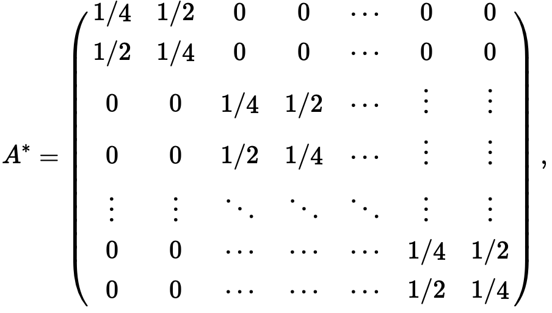

```{r setup, include=FALSE}
knitr::opts_chunk$set(echo = TRUE)
```

## Introduction

This is a tutorial for how to use the R functions in **Test_function.R** to conduct hypothesis testing for autoregressive parameters in high-dimenisonal linear AR(1) model, using the methods proposed in our paper [Testing for high-dimensional network parameters in auto-regressive models](https://projecteuclid.org/euclid.ejs/1576119708). The paper covers testing methods and theoretical guarantees for general AR(p) models, while for simplicity of presentation, we only consider AR(1) model here.

Specifically, we consider the following time series model: $$X_{t+1}=A^*X_t+\epsilon_t.$$ Based on data $(X_t)_{t=1-p}^{T}$, we test the hypothesis of whether a subset of entries ($d$ entries) in $A^*$ equal to an arbitrary vector $\mu\in \mathbb{R}^d$. We propose two test statistics $\tilde{U}_{T}$ and $\hat{R}_{T}$ that both converge in distribution to $\chi_d^2$ when the tested entries equal to $\mu$. 


## Example

Consider the following example where the matrix $A\in \mathbb{R}^{M\times M}$ is a block matrix:
```{r pressure, echo=FALSE, out.width = '50%'}

```

and $M=30$, the time series data is of size $N=500$.
```{r, message=FALSE}
source("Test_functions.R")
M=30;N=500;
A0=matrix(c(1/4,1/2,1/2,1/4),2,2)
A=matrix(rep(0,M^2),M,M)
for(i in 1:(M/nrow(A0)))
{
  A[c(nrow(A0)*i-1,nrow(A0)*i),c(nrow(A0)*i-1,nrow(A0)*i)]=A0
}
var=1;
X=data.generate(M,N,A,"unif",var)
```
Suppose we want to test the hypothesis that $A_{1,1:2}=(0.25,0.5)$, $A_{2,3:4}=(0,0)$ (which is true), then the following codes would give us two test statistics $\tilde{U}_N$ and $\hat{R}_N$.
```{r}
test=list(c(1,1,2),c(2,3,4));
mu=list(c(0.25,0.5),c(0,0));
ts=test_statistic(M,N,X,test,mu)
```
Here, each element of `test` specifies the tested entries in one row. In this example, `c(1,1,2)` in `test` means the first and second entries in the first row, while `c(2,3,4)` means the third and fourth entries of the second row. `ts` is a 2-dimensional vector where the first entry is $\tilde{U}_N$ and the second entry is $\hat{R}_N$.

$\tilde{U}_N$ and the corresponding $p$-value:
```{r}
ts[1]
1-pchisq(ts[1],df=4)
```
$\hat{R}_N$ and the corresponding $p$-value:
```{r}
ts[2]
1-pchisq(ts[2],df=4)
```
Both $p$-values are not significant, so we are not confident to reject the hypothesis using either of them.
If we want to test the hypothesis that $A_{1,3:5}=(0.25,0.25,0)$, $A_{3,3:4}=(0.25,0)$ (which is false), then the test statistics can be calculated as 
```{r}
test=list(c(1,3,4,5),c(3,3,4));
mu=list(c(0.25,0.25,0),c(0.25,0));
ts=test_statistic(M,N,X,test,mu)
ts[1]
ts[2]
```
Since we are testing for 5 entries, we should compare the test statistics to $\chi_5^2$ to get the $p$-value:
```{r}
1-pchisq(ts[1],df=5)
1-pchisq(ts[2],df=5)
```
Both $p$-values are significant, suggesting that the hypothesis should be rejected regardless of which test statistic we use.